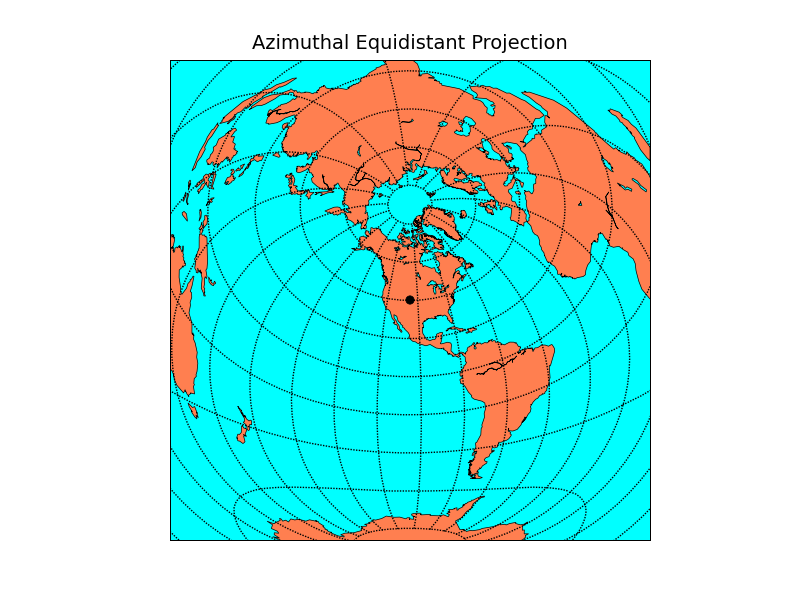

.. _azeqd:

Azimuthal Equidistant Projection
================================

The shortest route from the center of the map
to any other point is a straight line in the azimuthal
equidistant projection. Such lines show the true scale
on the earth's surface.
So, for the specified point, this script draws a map that shows
in which direction to depart for other points on earth and how far
it will be to reach that destination.
The specified point ``lon_0, lat_0`` shows up as a black dot in the center of the map.

.. literalinclude:: figures/azeqd.py

